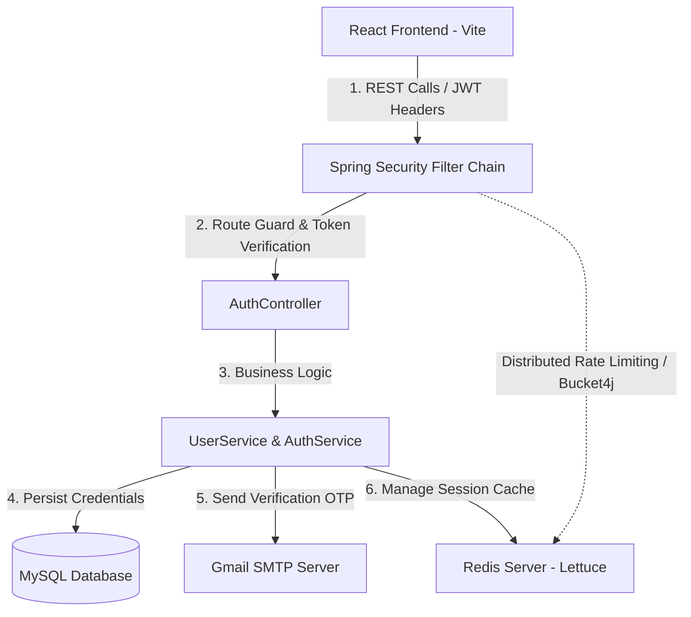

# Authify - Secure Authentication & User Management Portal

Authify is a secure, modern, full-stack user authentication and management portal. It comprises a responsive, premium React-based frontend and a robust Spring Boot backend designed around strict security principles. The application includes a self-healing view-based routing client, JWT-based stateless authentication, email-based OTP verification, forgot password workflows, and distributed rate limiting to safeguard resources against brute-force and spamming attempts.

---

## Overview

Authify addresses modern user identity and access management (IAM) needs with a sleek and responsive glassmorphism UI. Key features include:

*   **Robust Registration & Validation**: Safe user registration with field-level constraint checks (mandatory names, emails, phones, and passwords).
*   **Email-Based OTP Verification**: Unverified accounts are restricted from accessing system resources. Verification is completed by entering a 6-digit One-Time Password (OTP) dispatched using JavaMail via SMTP.
*   **JWT Session Management**: Stateful login attempts are avoided. Authentication returns short-lived JSON Web Tokens (access tokens) and longer-lived refresh tokens for automatic, stateless session verification.
*   **Secure Password Reset**: Seamless account recovery through OTP confirmation and BCrypt-encoded password replacement.
*   **Distributed Rate Limiting**: The system implements IP-based rate limiting on sensitive actions (such as generating OTPs) via Bucket4j integrated with Redis. This protects resources from email spamming and denial-of-service (DoS) attacks.
*   **Interactive Profile Dashboard**: Users can access and view their authenticated profiles through protected route endpoints that verify JWT headers.

---

## Architecture

Authify follows a classic client-server decoupled architecture where the React frontend communicates with the Spring Boot REST API:



1.  **Frontend Client**: React application powered by Vite, handling user interaction, styling via modular Vanilla CSS, and temporary token storage in local storage.
2.  **API Security Gateway**: Spring Security intercepting all HTTP calls. Public endpoints (login, register, reset password, Swagger docs) are permitted, while profile actions require a valid `Authorization: Bearer <JWT>` header.
3.  **Rate Limiting Interceptor**: An IP-based filter intercepting requests to the `/api/auth/generate-otp` endpoint, communicating with Redis via Lettuce to consume rate limit tokens.
4.  **Backend Services**: Java business services querying MySQL via Hibernate ORM for user records, generating cryptographically secure OTPs, and sending notifications through SMTP.

---

## Technologies

The application is built using the following technologies:

### Frontend
*   **React 19**: Modern component library for interactive user interfaces.
*   **Vite**: Rapid frontend tooling and Hot Module Replacement (HMR).
*   **Vanilla CSS**: High-performance, tailored styling with premium glassmorphism aesthetics, variables, and transition animations.

### Backend
*   **Java 21**: Leveraging modern runtime optimizations and virtual thread foundations.
*   **Spring Boot 4.0.6**: Core application container framework.
*   **Spring Security**: Role-based access control and JWT validation filter.
*   **Spring Data JPA / Hibernate**: Database persistence and mapping wrapper.
*   **Lettuce Redis**: High-performance Redis client for caching and Bucket4j integration.
*   **Bucket4j (8.9.0)**: Token bucket rate limiter implementation.
*   **JJWT (0.13.0)**: JSON Web Token library for Java.
*   **Springdoc OpenAPI (3.0.2)**: Automated JSON/YAML OpenAPI specification and Swagger UI documentation generator.
*   **Project Lombok**: Boilerplate reduction for model and DTO classes.

### Infrastructure
*   **MySQL**: Relational database storage for persistent user records.
*   **Redis**: Caching server for distributed rate limit buckets.
*   **SMTP Mail Server**: Gmail SMTP infrastructure for transactional notifications.

---

## System Prerequisites

To build and run Authify locally, ensure you have installed:

*   **Java Development Kit (JDK) 21**
*   **Node.js** (v18.x or higher) and **npm** (v9.x or higher)
*   **Maven 3.8+** (or use the provided `./mvnw` script in the backend directory)
*   **MySQL Server 8.0+**
*   **Redis Server 6.0+**
*   A Gmail account (with **App Passwords** enabled) or other SMTP credentials for email delivery.

---

## Installation & Setup

### 1. Database Setup
Log in to your local MySQL instance and create the database:
```sql
CREATE DATABASE authify_db;
```

### 2. Configuration Settings
Navigate to [backend/src/main/resources/application.properties](file:///Users/jateendhaduk/Documents/Authify/backend/src/main/resources/application.properties) and update the configuration variables:

```properties
spring.application.name=Authify 

# Database Connection Details
spring.datasource.url=jdbc:mysql://localhost:3306/authify_db
spring.datasource.username=YOUR_MYSQL_USERNAME
spring.datasource.password=YOUR_MYSQL_PASSWORD
spring.jpa.hibernate.ddl-auto=update

# JWT Secret (Ensure this is a 256-bit Base64-encoded string)
jwt.secret=UVdFUlRZVUlPUEFTREZHSEpLTFpYQ1ZCTk0xMjM0NTY3ODkwYWJjZGVmQUJDREVGR0g=
jwt.expiration-ms=86400000
app.jwt.refresh-expiration-ms=604800000

# Email SMTP Credentials (Gmail App Password required)
spring.mail.host=smtp.gmail.com
spring.mail.port=587
spring.mail.username=YOUR_EMAIL@gmail.com
spring.mail.password=YOUR_GMAIL_APP_PASSWORD
spring.mail.properties.mail.smtp.auth=true
spring.mail.properties.mail.smtp.starttls.enable=true
spring.mail.properties.mail.smtp.starttls.required=true

# Cache/Rate Limiting Expiry Configurations
app.otp.expiry-minutes=10

# Redis host and port config
spring.data.redis.host=127.0.0.1
spring.data.redis.port=6379
```

### 3. Frontend Package Installation
Navigate to the frontend folder and install the required dependencies:
```bash
cd frontend
npm install
```

---

## Running the Services

Ensure that your **MySQL** and **Redis** servers are running locally before starting the backend.

### Running the Backend Service
From the repository root, run the following commands:
```bash
cd backend
# Build the application
./mvnw clean install
# Start the Spring Boot application
./mvnw spring-boot:run
```
The backend API server will start on [http://localhost:8080](http://localhost:8080).

### Running the Frontend Service
Open a separate terminal window and run:
```bash
cd frontend
# Start the Vite development server
npm run dev
```
The client app will be accessible at [http://localhost:5173](http://localhost:5173).

### Accessing API Documentation
Once the backend is running, you can explore, test, and execute endpoints visually:
*   **Swagger UI**: [http://localhost:8080/swagger-ui/index.html](http://localhost:8080/swagger-ui/index.html)
*   **OpenAPI specification (JSON)**: [http://localhost:8080/v3/api-docs](http://localhost:8080/v3/api-docs)

---

## API Documentation

All API endpoints reside under the base path `/api/auth`. All requests and responses are exchanged as JSON payloads.

### Standard Response Envelope
The API returns a uniform response structure represented by the class [UserApiResponse](file:///Users/jateendhaduk/Documents/Authify/backend/src/main/java/com/example/Authify/dto/UserApiResponse.java):
```json
{
  "success": true,
  "statusCode": 200,
  "message": "Status description message",
  "data": { ... },
  "errors": null,
  "timeStamp": "2026-06-03T18:00:00"
}
```

### Endpoints Overview

#### 1. User Registration
*   **URL**: `/api/auth/register`
*   **Method**: `POST`
*   **Description**: Registers a new user. The account is set to `isVerified: false` initially. An OTP must be generated and verified to unlock the account.
*   **Request Payload**:
    ```json
    {
      "username": "johndoe",
      "email": "john@example.com",
      "phone": "+19876543210",
      "password": "SecurePass@123"
    }
    ```
*   **Response (200 Success)**:
    ```json
    {
      "success": true,
      "statusCode": 201,
      "message": "Account created successfully",
      "data": {
        "id": 1,
        "username": "johndoe",
        "email": "john@example.com",
        "phone": "+19876543210",
        "verified": false
      }
    }
    ```

#### 2. Generate / Send OTP
*   **URL**: `/api/auth/generate-otp`
*   **Method**: `POST`
*   **Description**: Sends a 6-digit OTP code to the requested email. Subject to IP-based rate limiting (Max 3 attempts per minute).
*   **Request Payload**:
    ```json
    {
      "email": "john@example.com"
    }
    ```
*   **Headers Returned**:
    *   `X-Rate-Limit-Remaining`: Remaining OTP requests available in the current window.
*   **Response (200 Success)**:
    ```json
    {
      "success": true,
      "statusCode": 200,
      "message": "OTP sent successfully"
    }
    ```
*   **Response (429 Rate Limited)**:
    *   Headers: `X-Rate-Limit-Retry-After-Seconds: 45`
    *   Body: `"Too many requests. Please wait 45 seconds."`

#### 3. Verify OTP
*   **URL**: `/api/auth/verify-otp`
*   **Method**: `POST`
*   **Description**: Verifies the received email OTP. Upon successful match, it updates the user status to `isVerified: true`.
*   **Request Payload**:
    ```json
    {
      "email": "john@example.com",
      "otp": "123456"
    }
    ```
*   **Response (200 Success)**:
    ```json
    {
      "success": true,
      "statusCode": 200,
      "message": "Account verified successfully"
    }
    ```

#### 4. Login User
*   **URL**: `/api/auth/login`
*   **Method**: `POST`
*   **Description**: Authenticates user using username and password. Returns access and refresh JWTs. Fails if account email has not been verified.
*   **Request Payload**:
    ```json
    {
      "username": "johndoe",
      "password": "SecurePass@123"
    }
    ```
*   **Response (200 Success)**:
    ```json
    {
      "success": true,
      "statusCode": 200,
      "message": "Login successful",
      "data": {
        "userName": "johndoe",
        "email": "john@example.com",
        "role": "USER",
        "accessToken": "eyJhbGciOi...",
        "refreshToken": "7b0932cd...",
        "tokenType": "Bearer",
        "expiresIn": 86400
      }
    }
    ```

#### 5. Request Password Reset OTP
*   **URL**: `/api/auth/forgot-password`
*   **Method**: `POST`
*   **Description**: Dispatches a recovery OTP to the user's email if the account exists.
*   **Request Payload**:
    ```json
    {
      "email": "john@example.com"
    }
    ```
*   **Response (200 Success)**:
    ```json
    {
      "success": true,
      "statusCode": 200,
      "message": "OTP sent successfully"
    }
    ```

#### 6. Confirm Password Reset
*   **URL**: `/api/auth/reset-password`
*   **Method**: `POST`
*   **Description**: Resets the password after verifying the OTP.
*   **Request Payload**:
    ```json
    {
      "email": "john@example.com",
      "otp": "123456",
      "newPassword": "MyNewSecurePassword!9"
    }
    ```
*   **Response (200 Success)**:
    ```json
    {
      "success": true,
      "statusCode": 200,
      "message": "successfully reset password"
    }
    ```

#### 7. Fetch Authenticated Profile
*   **URL**: `/api/auth/profile`
*   **Method**: `GET`
*   **Headers Required**: `Authorization: Bearer <ACCESS_TOKEN>`
*   **Description**: Fetches current user detail context based on credentials extracted from the bearer token.
*   **Response (200 Success)**:
    ```json
    {
      "success": true,
      "statusCode": 200,
      "message": "WellCome back",
      "data": {
        "id": 1,
        "username": "johndoe",
        "email": "john@example.com",
        "phone": "+19876543210",
        "verified": true
      }
    }
    ```

---

## Contributing

We welcome contributions to improve Authify. To contribute, follow these guidelines:

1.  **Fork the Repository**: Create a personal copy of the repository.
2.  **Create a Feature Branch**:
    ```bash
    git checkout -b feature/your-awesome-feature
    ```
3.  **Adhere to Coding Standards**:
    *   Maintain backend formatting (e.g., standard Maven checkstyle structures).
    *   Preserve existing docstrings and comments.
    *   Keep styling aligned with the global glassmorphic design theme in the frontend.
4.  **Test Your Changes**: Verify that local builds complete successfully and run tests using `./mvnw test` or postman collections in [backend/API_TEST_SCENARIOS.json](file:///Users/jateendhaduk/Documents/Authify/backend/API_TEST_SCENARIOS.json).
5.  **Commit and Push**: Write descriptive commit messages and push changes:
    ```bash
    git commit -m "feat: add user session timeout config"
    git push origin feature/your-awesome-feature
    ```
6.  **Open a Pull Request**: Submit your pull request to the `main` branch for code review.
